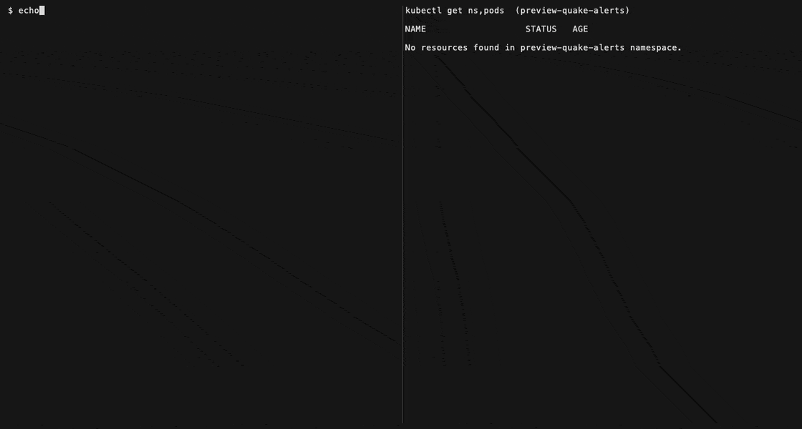

# caldera-platform

Platform for Prismatic HQ preview environments. AWS CDK (Python) provisions EKS with Cilium and
Karpenter; each preview environment is a namespace plus a Helm release deployed from CI by the
`preview` CLI.

Related repos:
- [tremor-api](https://github.com/prismatic-hq/tremor-api): seismic signal streams and alerts
- [steward-api](https://github.com/prismatic-hq/steward-api): sites, crews and work orders

Docs:
- [REQUIREMENTS.md](docs/REQUIREMENTS.md) and [ARCHITECTURE.md](docs/ARCHITECTURE.md)
- [DEVELOPMENT.md](docs/DEVELOPMENT.md): mise tools and tasks
- [GITHUB_APP.md](docs/GITHUB_APP.md): GitHub App for runners and service checkouts
- [CLUSTER_ACCESS.md](docs/CLUSTER_ACCESS.md): `kubectl` access to the private EKS API

## Demo

Recorded against the live sandbox platform. Tapes to re-record them live in
[docs/media/tapes](docs/media/tapes) (`vhs docs/media/tapes/<name>.tape`).

**Deploy the platform**: `cdk deploy --all` on stacks already at head, so every stack reports no changes.


**Push a feature branch**: a commit to `feature/quake-alerts` in tremor-api creates
`preview-quake-alerts` with steward on `main`; the URL answered 166s after `git push`.



**Second environment and capacity**: `feature/tsunami` in steward-api, with headroom pods,
NodeClaims and pending preview pods watched alongside; the URL answered 59s after `git push`.
Recorded on a weekend, when the KEDA cron scales headroom to zero, so no preemption is shown.


## Layout

| Path | Contents |
|---|---|
| `cdk/` | CDK stacks, constructs, Lambda handlers and cdk-nag suppressions |
| `cli/`, `services.yaml` | `preview env resolve\|up\|down\|reset\|test` and the service registry it reads |
| `charts/service/` | Helm chart for one HTTP service: Deployment, Service, optional HTTPRoute |
| `charts/services/` | Umbrella chart that allows a consumer to easily deploy all services for an environment. Works for ephemeral/preview environments, stable environments, etc. |
| `platform/` | PriorityClasses, headroom Deployment, KEDA `ScaledObject` |
| `seeder/`, `images/golden-db/` | Golden dataset and golden DB image |
| `contracts/events/` | CloudEvents envelope, registry, data schemas and examples |
| `e2e/`, `local/` | E2E suite, kind + Tilt |
| `scripts/` | Helpers behind the mise tasks and the golden-image workflow |
| `.github/workflows/` | CI, preview environment up/teardown, golden image |

## Quick Start

Requires Python 3, Docker and the 1Password desktop app with **Settings > Developer > Integrate
with 1Password CLI** on. `setup.py` installs mise, the pinned tools, Python dependencies and git
hooks ([DEVELOPMENT.md](docs/DEVELOPMENT.md)).

```sh
python3 setup.py    # then, with mise on PATH: mise run test
```

## Key Commands

| Command | What it does |
|---|---|
| `mise run init` | `uv sync --locked` and pre-commit hooks |
| `mise run test` | pytest, helm unittest, ct lint, kubeconform, trivy config |
| `ENV=sandbox.yaml mise run synth` | `cdk synth` with cdk-nag `AwsSolutionsChecks` |
| `mise run bootstrap` | One-time `cdk bootstrap` of the account and region |
| `ENV=sandbox.yaml mise run deploy` | Deploy every stack with `deploy/environments/sandbox.yaml` |
| `ENV=sandbox.yaml mise run dns:nameservers` | Print the hosted zone's Route 53 nameservers for the registrar |
| `mise run secrets:put` | GitHub App credentials to SSM for the runners, read from 1Password |
| `mise run secrets:github -- --region us-east-2` | GitHub App secrets and `AWS_REGION` on every repo, read from 1Password |
| `mise run secrets:role-arns` | `AWS_ROLE_ARN` on each service repo, from the `CalderaCiAccess` push role outputs |
| `mise run kube:connect` | Tunnel to the private EKS API and `kubectx caldera` |
| `mise run destroy` | Destroy every stack, then `mise run verify:clean` |
| `mise run local:up` / `mise run local:down` | kind cluster with Cilium, KEDA and `platform/` |
| `uv run preview env up ... --dry-run` | Print the Helm command for a preview environment |
| `uv run preview env test --name <env>` | Run the E2E Helm test hook; CI reports it as the `e2e` check |
| `mise run demo` | Step through the demo against eks; `-- --dry-run`, `--only N`, `--cleanup` |

## Deploy

Settings live in `deploy/environments/<name>.yaml`, keyed like CDK context. `-c key=value` overrides the file.

| Key | Default |
|---|---|
| `domain` | Required |
| `natGateways` | `1` (1 or 2) |
| `budgetEmail`, `acmeEmail` | `platform@<domain>` |
| `previewAllowlistCidrs` | Empty |
| `clusterAdminPrincipals` | Account root ([CLUSTER_ACCESS.md](docs/CLUSTER_ACCESS.md)) |

Steps:

1. `mise run bootstrap` (once per account and region).
2. `ENV=<name>.yaml mise run deploy`.
3. `ENV=<name>.yaml mise run dns:nameservers`, then set those as the domain's NS records at its registrar.
4. `mise run secrets:put` after every fresh deploy ([GITHUB_APP.md](docs/GITHUB_APP.md)).
5. `mise run secrets:role-arns` after every deploy that creates or replaces the CI push roles, so the service repos get `AWS_ROLE_ARN`.
6. `mise run kube:connect` for `kubectl` access.
